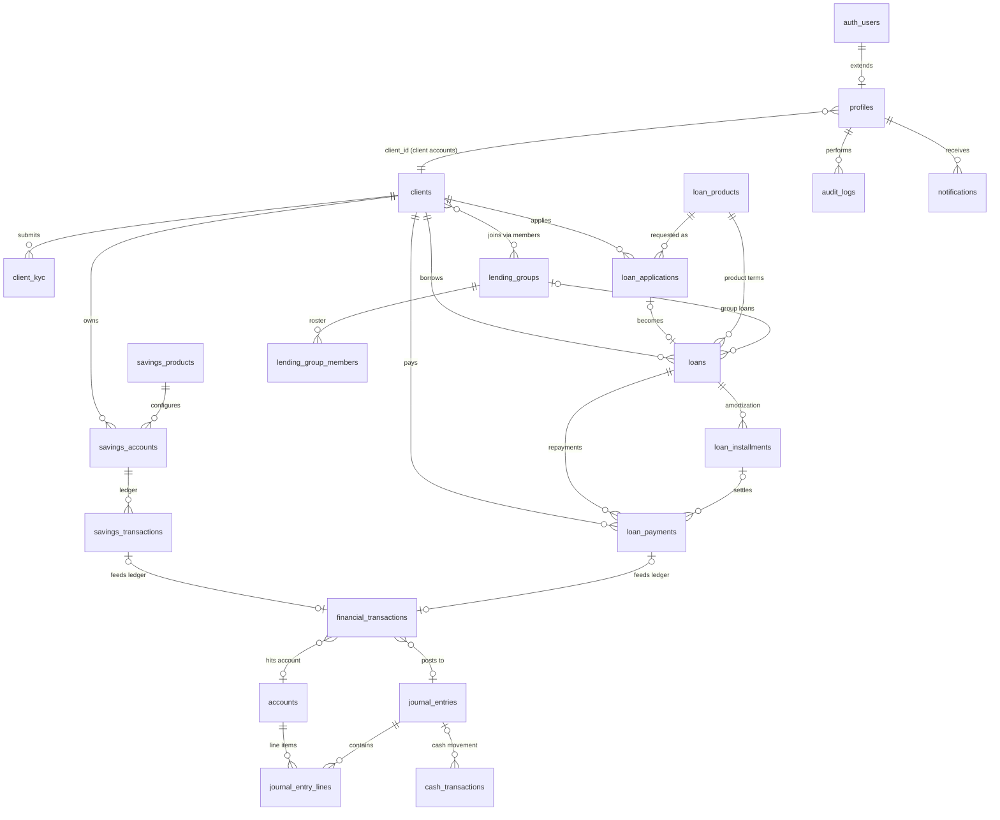

# Database Design — Client Services & Financial Transactions Module

**Project:** Design and Development of a Client Services and Financial Transaction Management System for Microfinance Institutions with Mobile-Based Client Self-Service Portal and Group Lending Support
**Module:** Client Services & Financial Transactions
**Phase:** 1 of 17 (Database Schema — FOR REVIEW)
**Target:** Supabase (PostgreSQL 15+), Supabase Auth

---

## 1. How to Apply

Run the migration files **in order** in the Supabase SQL Editor against a **fresh project**:

```
database/migrations/0001_extensions_and_enums.sql
database/migrations/0002_identity_and_clients.sql
database/migrations/0003_savings.sql
database/migrations/0004_loans.sql
database/migrations/0005_groups.sql
database/migrations/0006_financial_ledger.sql
database/migrations/0007_audit_and_notifications.sql
database/migrations/0008_functions_and_triggers.sql
database/migrations/0009_row_level_security.sql
database/migrations/0010_configuration_seed.sql   -- optional but recommended
```

> ⚠️ These files intentionally use plain `CREATE TABLE` (no `IF NOT EXISTS`) so that running them
> against a database containing the legacy HOSCOMO demo tables fails loudly on name collisions
> (`savings_accounts`, `savings_transactions`, `loan_products`, `loans`). Use a fresh Supabase project.

---

## 2. ERD Overview

Core relationships (Mermaid renders natively on GitHub):



---

## 3. Entity Catalog

### 3.1 Identity & Access

#### `profiles` — extends `auth.users` (Supabase Auth)
| Column | Type | Notes |
|---|---|---|
| id | UUID PK | = `auth.users.id`, ON DELETE CASCADE |
| full_name | TEXT NOT NULL | |
| phone | TEXT | |
| role | `user_role` ENUM | admin / manager / loan_officer / teller / client |
| client_id | UUID FK → clients | set for client-role users; NULL for staff |
| is_active | BOOLEAN DEFAULT true | deactivation switch |
| created_at / updated_at | TIMESTAMPTZ | auto-maintained |

Auto-provisioned by trigger `on_auth_user_created` → `handle_new_user()` (§0008). Roles come from
Signup metadata (`role`, `full_name`), defaulting to `client`.

#### `clients`
Spec §13 fields + registration/KYC-adjacent attributes. Highlights:

- `client_code` UNIQUE — generated `CL-{YYYY}-{00001}` from sequence.
- Duplicate prevention: unique index on `LOWER(email)`; verified KYC IDs are globally unique
  (partial unique index on `client_kyc (id_type, id_number) WHERE verification_status='verified'`).
- Address decomposed: `street_address`, `barangay`, `city_municipality`, `province`.
- Employment block: `employment_status`, `employer_business_name`, `occupation`, `monthly_income NUMERIC(14,2) CHECK >= 0`.
- Emergency contact: `_name`, `_phone`, `_relation`.
- `status client_status`: pending / active / inactive / suspended / closed. `registration_date DATE`.
- `registered_by UUID FK → profiles` — auditability at creation.

#### `client_kyc`
- `kyc_id`, `client_id FK`, `id_type`, `id_number`, `document_url` (Supabase Storage path),
  `verification_status kyc_status`: **pending / verified / rejected / expired**,
  `verified_by → profiles`, `verified_at`, `remarks`, `expiry_date` (drives *Expired*).

### 3.2 Savings

#### `savings_products` — configurable settings, **no hard-coded rates**
`product_code UNIQUE`, `product_name`, `product_type` (regular / special_deposit / time_deposit),
`minimum_deposit`, `maintaining_balance`, `interest_rate NUMERIC(5,3)` (annual %, DB-stored),
`interest_posting_frequency` (none/monthly/quarterly/annually), `term_days`,
`withdrawal_lockup_days`, `start_date`, `end_date`, `status product_status`.

#### `savings_accounts`
`savings_account_id`, `client_id FK`, `savings_product_id FK`, `account_number UNIQUE`
(`SA-{YYYY}-{000001}`), `opening_date`, `balance NUMERIC(14,2) NOT NULL DEFAULT 0
CHECK (balance >= 0)`, `status account_status` (active/dormant/frozen/closed), `closed_at`,
`closure_reason`, `opened_by`.

#### `savings_transactions` — immutable-style passbook ledger
`transaction_type` (deposit / withdrawal / interest_credit / adjustment / fee),
`amount CHECK (> 0)`, **`balance_before` + `balance_after` NOT NULL** (ledger integrity:
balance must equal prior row's `balance_after`; enforced in the Phase 5 RPC),
`reference_number UNIQUE` (`STX-...`), `financial_transaction_id FK` (central-ledger linkage),
`performed_by → profiles`, `status txn_status` (completed/pending/reversed).

### 3.3 Loans

#### `loan_products`
`product_code UNIQUE`, `product_name`, `loan_type` (business/personal/agricultural/emergency/
educational/other), `interest_rate NUMERIC(5,3)`, `interest_method` (**flat_rate /
reducing_balance** — needed for Phase 9 amortization), `minimum_amount ≤ maximum_amount`
(CHECK), `min_term_months ≤ max_term_months` (CHECK), `payment_frequency`
(daily/weekly/bi_weekly/semi_monthly/monthly), `processing_fee_percent`, `late_penalty_rate`,
collateral/guarantor flags, `status`.

#### `loan_applications`
`application_number UNIQUE` (`LAP-...`), `client_id FK`, `loan_product_id FK`,
`requested_amount > 0`, `term_months`, `payment_frequency`, `purpose`,
`status application_status`: **draft / submitted / under_review / approved / rejected / cancelled**,
`approved_amount`, `reviewed_by`, `reviewed_at`, `review_remarks`.
Service rule (Phase 7): submission requires KYC status = verified.

#### `loans`
`loan_number UNIQUE` (`LN-{YYYY}-{00001}`), `loan_application_id FK UNIQUE` (traceability),
`client_id FK`, `loan_product_id FK`, **`group_id FK NULL` → group loans**, principal/interest/
method/frequency/term/`number_of_installments`, `total_interest`, `total_payable`,
`outstanding_balance NUMERIC CHECK (>= 0)`, `maturity_date`,
`status loan_status`: **draft / submitted / under_review / approved / rejected / disbursed /
active / fully_paid / defaulted / cancelled**, `disbursed_at`, `disbursed_by`,
`next_due_date` + `days_in_arrears` (denormalized dashboard accelerators).

Guardrail (spec §7): disbursement only when `status='approved'` AND `loan_application.status='approved'`
AND KYC verified AND `outstanding_balance=0` — enforced server-side (Phase 8 service + DB function).

#### `loan_installments`
`UNIQUE (loan_id, installment_number)`, `due_date`, `principal_amount`, `interest_amount`,
`penalty_amount`, **`total_due GENERATED ALWAYS AS (principal+interest+penalty) STORED`**,
`amount_paid CHECK (>= 0 AND <= total_due)`,
`status installment_status`: **pending / partially_paid / paid / overdue**, `paid_at`.

Overdue sweep: SQL function `mark_overdue_installments()` (§0008) callable nightly by backend
scheduler (Render cron / GitHub Actions schedule). Penalty accrual lands in Phase 10.

#### `loan_payments`
`payment_number UNIQUE` (`PAY-...`), `loan_id FK`, `installment_id FK NULL` (payments may span
installments; allocation computed in Phase 10 service), `client_id FK`, `amount > 0`,
`payment_method` (cash/bank_transfer/e_wallet/other), `reference_number`, `received_by → profiles`,
`financial_transaction_id FK`, `status txn_status`.

### 3.4 Group Lending

#### `lending_groups`
`group_code UNIQUE` (`GRP-...`), `group_name`, `formation_date`, `leader_client_id FK → clients`
(nullable until assigned; assignment action per spec §9), `status group_status`
(active/inactive/dissolved).

#### `lending_group_members`
`group_id FK CASCADE`, `client_id FK`, `role group_role` (**leader / member**), `joined_at`,
`left_at`, `status member_status` (**active / inactive / removed**).
**Duplicate-active guard:** partial `UNIQUE (group_id, client_id) WHERE status='active'`.
Leader consistency (`leader_client_id` ⇔ an active leader-member row) is enforced in the
Phase 11 service layer.

### 3.5 Central Financial Ledger & FinMgmt Integration Points

#### `financial_transactions` — the module's single source of truth for money events
`transaction_code UNIQUE` (`TXN-...`), `client_id FK NULL`, `transaction_type fin_txn_type`
(savings_deposit / savings_withdrawal / interest_credit / loan_disbursement / loan_repayment /
fee / penalty / adjustment), `direction entry_direction` (**debit/credit** — added beyond spec;
required so the FinMgmt module can post without re-deriving), `amount > 0`,
`source_module` (constant `'client_services'`), `source_table` + `source_id` (polymorphic link to
savings_transactions / loan_payments / loans / …), optional `account_id FK` + `journal_entry_id FK`,
`created_by`, `status txn_status`.

**Insert policy: NO RLS insert policy exists for authenticated roles → only the backend
(service-role key) can create rows.** Same pattern for `audit_logs`. This structurally enforces
spec §11 ("frontend must never create financial balances").

#### FinMgmt stubs (spec §12 — integration points, not full accounting)
- `accounts` (account_code UNIQUE, account_name, account_type, normal_balance, status)
- `journal_entries` (entry_date, description, reference_number, source_module, source_id, status draft/posted/void)
- `journal_entry_lines` — **added beyond spec**: double-entry requires ≥ 2 lines with
  `CHECK (debit = 0 OR credit = 0)` per line and entry-level debit=credit balance check via trigger (Phase 12).
- `cash_transactions` (journal_entry_id FK, transaction_code UNIQUE, transaction_type, amount > 0, source_module, source_id)

Event flow contract (implemented Phases 5–12):
```
Savings deposit    → savings_transactions + financial_transactions(credit) → journal_entry(+lines)
Loan disbursement  → financial_transactions(debit Loans Receivable / credit Cash) → journal_entry
Loan repayment     → financial_transactions(debit Cash / credit Loans Receivable+Interest Income) → journal_entry
Penalty / fee      → financial_transactions → journal_entry
```

### 3.6 Audit & Notifications

#### `audit_logs`
`audit_log_id BIGINT GENERATED ALWAYS AS IDENTITY PK` (UUID wasteful at append-only volume),
`user_id FK NULL`, `actor_role` snapshot, `action`, `module`, `record_table`, `record_id UUID`,
`old_values JSONB`, `new_values JSONB`, `ip_address`, `user_agent`, `timestamp`.
Indexes: `(module, record_id)`, `(user_id, timestamp DESC)`.

#### `notifications`
`profile_id FK CASCADE`, `title`, `body`, `type notification_type`, `reference_table/reference_id`,
`is_read`, `read_at`. Index `(profile_id, is_read, created_at DESC)`.

---

## 4. Cross-Cutting Decisions

| # | Decision | Rationale |
|---|---|---|
| D1 | `NUMERIC(14,2)` for money, `NUMERIC(5,3)` for rates | Floats corrupt currency math; industry standard |
| D2 | PostgreSQL ENUM types for all statuses | Integrity + readable; `ALTER TYPE ... ADD VALUE` extends cleanly |
| D3 | Business codes via sequences (`CL-2026-00001`) | Human-readable references for tellers/members |
| D4 | Generated column `total_due`; denormalized `outstanding_balance`, `next_due_date` | Read performance; kept consistent exclusively by backend transactions (Phases 5–12) |
| D5 | Balances never updated directly by frontend | RLS blocks client writes; mutations go through backend RPC/service inside DB transactions |
| D6 | `updated_at` maintained by generic trigger | §0008 `set_updated_at()` |
| D7 | Audit written by service layer (not generic triggers) | Captures intent + old/new values precisely per event list (spec §21); generic triggers over-fire on cascades |

## 5. RLS Model Summary (details in 0009)

Helper `SECURITY DEFINER` functions: `get_my_role()`, `get_my_client_id()`, `is_staff()`.

| Table | client role | staff roles | writes via service key only |
|---|---|---|---|
| profiles | read/update self | read all; admin manages | role/client_id changes guarded by trigger |
| clients | read own | full (admin: delete) | |
| client_kyc | read own; submit own (pending only) | verify/reject/update | |
| savings/loan products | read | admin+manager write | |
| savings_accounts / _transactions | read own | staff write (teller: deposits/withdrawals) | |
| loan_applications | read own; submit own | review/approve/reject | |
| loans, installments | read own | staff write | |
| loan_payments | read own | teller/officer+ insert | |
| groups / members | read own memberships | staff manage | |
| financial_transactions | read own | read | ✅ INSERT |
| journal stack | – | admin/manager read+write | |
| audit_logs | – | admin/manager read | ✅ INSERT |
| notifications | read/update own (is_read) | system inserts | |

Fine-grained role rules (teller cannot approve, officer cannot post interest, etc.) are enforced
in Express authorization middleware (Phase 2) — RLS is the second line of defense, not the first.

## 6. Deliberate Additions Beyond Spec (flagged for approval)

1. `journal_entry_lines` — double-entry integrity for FinMgmt integration.
2. `notifications` table — portal requirement §10 needs persistence.
3. `direction` (debit/credit) on `financial_transactions` — clean handoff to accounting.
4. `interest_method` on `loan_products` — flat vs reducing changes amortization math (Phase 9).
5. `profiles.actor_role` snapshot on audit rows — role history survives role changes.

## 7. Known Limitations / Later Phases

- Balance mutation RPCs (`process_savings_txn`, `disburse_loan`, `record_payment`) arrive with their phases — schema alone does not mutate balances.
- Overdue sweep requires a scheduler (Render cron / GH Action) calling `mark_overdue_installments()`.
- Full-text/trigram search indexes included where cheap (`pg_trgm` on client name); heavier search deferred.
