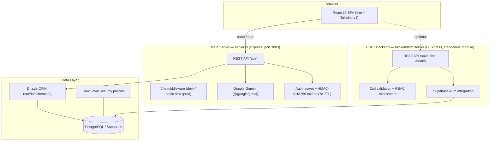
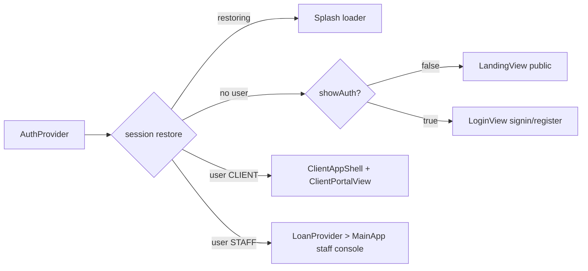
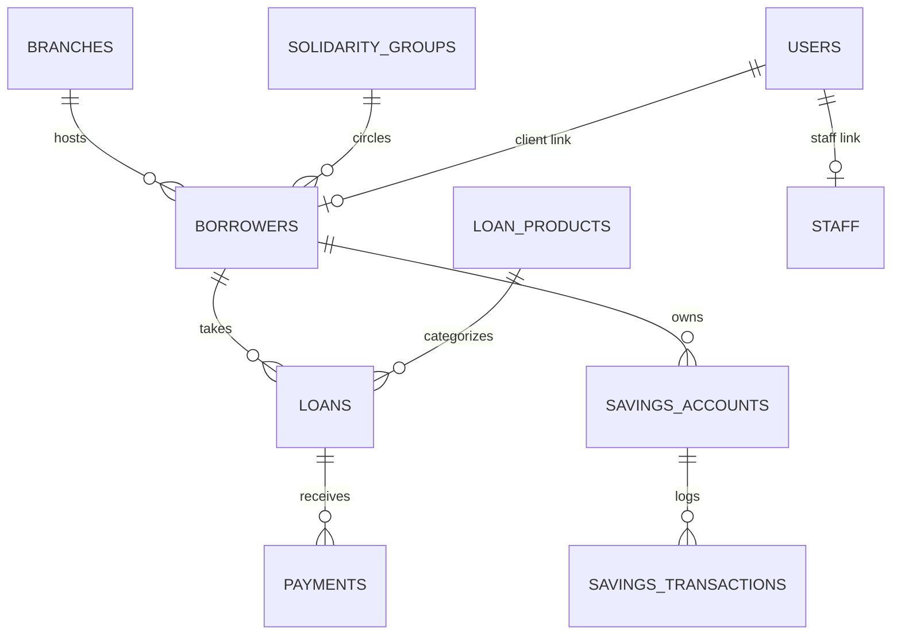

# HOSCOMCO System Schema

Complete architecture, data model, and API reference for the **HOSCOMCO Cooperative Loan & Savings Management System**.

---

## 1. High-Level Architecture



Two server entry points exist:

| Entry point | Tech | Role |
|---|---|---|
| `server.ts` | Express + tsx/esbuild | Serves the SPA and the full co-op management API. Default port **3003** (`PORT` env). |
| `backend/src/server.js` | Express + nodemon | Standalone **Client Services & Financial Transactions (CSFT)** auth microservice against Supabase, with its own `package.json`. |

---

## 2. Repository Layout

```
├── server.ts               # Main API + static host (TypeScript)
├── src/
│   ├── main.tsx            # React entry
│   ├── App.tsx             # AuthGate routing: Landing → Login → role shells
│   ├── types.ts            # Shared domain types
│   ├── auth/index.ts       # scrypt hashing, HMAC token sign/verify, user store
│   ├── context/
│   │   ├── AuthContext.tsx # Session state (login/register/logout/restore)
│   │   └── LoanContext.tsx # Staff console domain state (~1400 lines)
│   ├── components/         # 35 view & modal components
│   ├── db/
│   │   ├── schema.ts       # Drizzle table definitions (16 tables)
│   │   ├── index.ts        # Lazy DB connection (Cloud SQL / Supabase URL)
│   │   └── seed.ts         # Idempotent demo seed
│   ├── lib/supabase.ts     # Browser Supabase client (VITE_* env)
│   └── utils/loanMath.ts   # Amortization / interest calculations
├── backend/                # CSFT auth microservice (plain JS, ESM)
│   └── src/{routes,services,controllers,middleware,validators,utils}
├── database/migrations/    # Supabase Postgres migrations 0001–0010
├── supabase_schema.sql     # Full consolidated schema dump
├── public/supabase_schema.sql
├── Dockerfile / docker-compose.yml
└── docs/SYSTEM_SCHEMA.md   # This document
```

---

## 3. Frontend Architecture

### Routing gate (`src/App.tsx`)



- **Public landing** (`LandingView.tsx`) → "Sign In" opens `LoginView` (with back navigation).
- **Role shells**: `CLIENT` gets a slim portal shell; `STAFF` gets the full console.
- Session persists via `/api/auth/me` restore on boot.

### Staff console tabs (`Navigation.tsx`)

Dashboard · Membership · Loans · Payments · Savings · Group Lending · Client Portal · Reminders · Calculator · Branches · Products · Reports

### State model

| Context | Scope | Notes |
|---|---|---|
| `AuthContext` | Whole app after login | Holds `AuthUser {id,email,fullName,role,staffId,borrowerId,avatar}` |
| `LoanContext` | Staff console only | Borrowers, loans, payments, branches, products, groups, savings, audit log; modal orchestration lives in `MainApp` |

---

## 4. API Reference — Main Server (`server.ts`)

Auth = `Authorization: Bearer <HMAC token>`; roles enforced by `requireAuth([roles])`.

| Method | Path | Access | Purpose |
|---|---|---|---|
| GET | `/api/health` | public | Liveness probe |
| POST | `/api/auth/login` | public | Email+password → token + user |
| POST | `/api/auth/register` | public | Client self-signup (auto-links by member no./email) |
| GET | `/api/auth/me` | any authed | Restore session from token |
| GET | `/api/auth/demo-accounts` | public | Demo credentials for login screen |
| GET | `/api/db/status` | STAFF | DB connection + row counts |
| POST | `/api/db/test-connection` | STAFF | Connectivity test |
| POST | `/api/db/seed` | STAFF | Seed database if empty |
| GET | `/api/db/all` | STAFF | Bulk fetch all tables for console hydration |
| GET | `/api/borrowers` | STAFF | List members (desc by created) |
| POST | `/api/borrowers` | STAFF | Create member |
| PUT | `/api/borrowers/:id` | STAFF | Update member |
| GET | `/api/loans` | STAFF | List loans |
| POST | `/api/loans` | STAFF | Originate loan |
| PUT | `/api/loans/:id` | STAFF | Update loan (status workflow etc.) |
| POST | `/api/payments` | STAFF | Record payment |
| GET | `/api/solidarity-groups` | STAFF | List groups |
| POST | `/api/solidarity-groups` | STAFF | Create group |
| PUT | `/api/solidarity-groups/:id` | STAFF | Update group |
| POST | `/api/gemini/underwrite` | STAFF | AI credit-underwriting report |
| POST | `/api/gemini/reminder-draft` | STAFF | AI collections reminder draft |
| POST | `/api/gemini/restructure-advice` | STAFF | AI loan restructuring advice |
| GET | `*` (non-API) | public | SPA fallback → index.html |

## 5. API Reference — CSFT Backend (`backend/src`)

Envelope: `{ success, data }` on success; `{ success:false, message, errorCode, details? }` on failure.

Middleware chain: `helmet` → `cors` → JSON body parser → route → `validate(zodSchema)` → controller → central `errorHandler`.

| Method | Path | Access | Purpose |
|---|---|---|---|
| GET | `/api/health` | public | Probes Supabase reachability |
| POST | `/api/auth/client/signup` | public | Zod-validated client registration (PH mobile format, CL-code) |
| POST | `/api/auth/login` | public | Login via Supabase auth |
| POST | `/api/auth/logout` | authed | Revoke session |
| GET | `/api/auth/me` | authed | Profile + role (RBAC: admin/manager/loan_officer/teller/client) |
| POST/PATCH | `/api/auth/*` | varies | Staff creation, status updates |

---

## 6. Data Model

### 6.1 Application schema (Drizzle — `src/db/schema.ts`, used by main server)

**Identity & org:** `users`, `staff`, `branches`

**Membership:** `borrowers` (member no., KYC status, credit score/tier, income/expenses, savings/share-capital balances), `membership_applications` (multi-step pipeline incl. background investigation + BoD review), `member_update_requests`, `member_follow_up_logs`

**Loans:** `loans` (product snapshot, schedule jsonb, coop workflow step, arrears tracking), `payments` (principal/interest/penalty/rebate split, receipt no.), `loan_products`

**Savings:** `savings_accounts`, `savings_transactions`, `savings_withdrawal_requests` (teller → manager approval flow), `interest_credit_logs`

**Groups:** `solidarity_groups` (joint liability, center/meeting info, fund balance)

**Audit:** `audit_logs` (action, actor, target, IP)

### 6.2 Supabase SQL schema (`database/migrations/0001–0010`)

| Migration | Contents |
|---|---|
| 0001 | Extensions + enums |
| 0002 | `profiles`, `clients`, `client_kyc` |
| 0003 | `savings_products`, `savings_accounts`, `savings_transactions` |
| 0004 | `loan_products`, `loan_applications`, `loans`, `loan_installments`, `loan_payments` |
| 0005 | `lending_groups`, `lending_group_members` |
| 0006 | Double-entry ledger: `accounts`, `journal_entries`, `journal_entry_lines`, `cash_transactions`, `financial_transactions` |
| 0007 | `audit_logs`, `notifications` |
| 0008 | Functions & triggers (auto-numbering, balance maintenance) |
| 0009 | Row Level Security policies |
| 0010 | Configuration seed |

### 6.3 Core relationships



---

## 7. Security Model

| Layer | Mechanism |
|---|---|
| Password storage | scrypt (16-byte salt, 64-byte key, timing-safe compare) — zero external deps |
| Sessions | HMAC-SHA256 signed tokens, 7-day expiry, verified per request; role claim `STAFF` \| `CLIENT` |
| API authorization | `requireAuth(roles)` middleware on every sensitive route (all mutating routes are STAFF-gated) |
| CSFT backend | Zod strict schemas, RBAC constants, helmet, centralized error envelope (no internal leakage) |
| Database | Supabase RLS policies (migration 0009); service vs anon keys split |
| Secrets | `.env` only (see §8); never committed — `.env.example` is the template |

---

## 8. Environment Variables

| Variable | Used by | Purpose |
|---|---|---|
| `PORT` | server.ts | HTTP port (default 3003) |
| `AUTH_SECRET` | server.ts | Token signing key |
| `DATABASE_URL` / `CLOUD_SQL_DATABASE_URL` / `SUPABASE_DATABASE_URL` | Drizzle | Postgres connection(s) |
| `SUPABASE_URL` / `SUPABASE_ANON_KEY` / `SUPABASE_SERVICE_ROLE_KEY` | backend/, db layer | Supabase project access |
| `VITE_SUPABASE_URL` / `VITE_SUPABASE_ANON_KEY` | browser client | Direct client-side Supabase |
| `GEMINI_API_KEY` | Gemini endpoints | AI underwriting/drafting |
| `CORS_ORIGINS` | servers | Allowed browser origins |
| `DISABLE_HMR` | vite.config.ts | Disable HMR/watching in sandboxed editors |

---

## 9. Build & Run

| Command | What it does |
|---|---|
| `npm run dev` | tsx hot-reloads `server.ts` (API + Vite middleware) at :3003 |
| `npm run build` | `vite build` SPA → `dist/`, esbuild-bundles server → `dist/server.cjs` |
| `npm start` | Runs production bundle `node dist/server.cjs` |
| `npm run lint` | Type-check entire TS project (`tsc --noEmit`) |
| `npx tsc -p backend/jsconfig.json` | Type-check the CSFT backend JS (checkJs) |
| `cd backend && npm run dev` | Run CSFT microservice standalone (nodemon, Node ≥20) |
| `docker compose up` | Containerized stack (see `Dockerfile`, `docker-compose.yml`) |

---

## 10. Verification Checklist

- [x] `npm run lint` — 0 errors (root TS project)
- [x] `npx tsc -p backend/jsconfig.json` — 0 errors (backend JS project)
- [x] `node --check` — all 18 backend files syntactically valid
- [x] `npm run build` — SPA + server bundle succeed
- [x] Runtime smoke test — `/api/health` 200 OK, SPA served with correct title
